---
author:
- |
  Dean Zhou, Chris Kim, Neha Konakalla, Dylan Schuler, Joseph Amine\
  Department of Computer Science\
  Stanford University\
  Stanford, CA 94305\
  `{deanzhou, chankyo, nkona, schu8991, jamine}@stanford.edu`\
bibliography:
- bibliography.bib
title: "Lecture #06: Features and Matching"
---

# Scale invariant keypoint detection

## Problem

The Harris Corner Detector is not scale invariant, meaning that
identifying key points (e.g. corners) is not generalizable to the same
image at different scales.

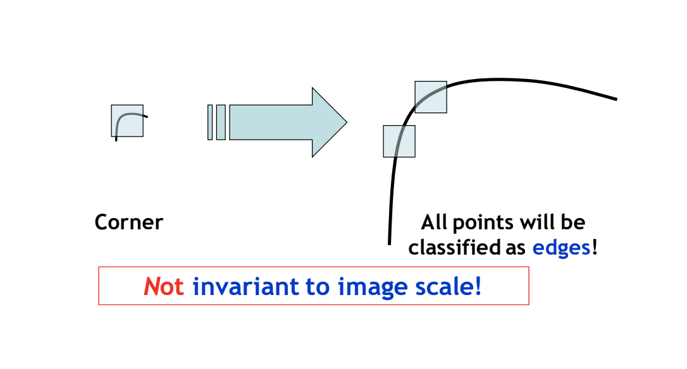{width="\\textwidth"}

In reality, we would like to be able to match keypoints between images
of different scale, so estimating the appropriate size of the
neighborhood around the keypoint for each individual image independently
is necessary.

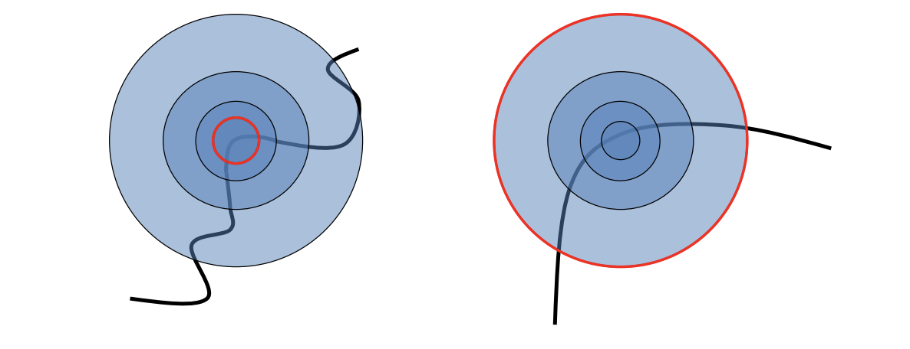{width="\\textwidth"}

## Solution

We can address the issue above by designing a function with respect to
region size around the keypoint, which yields different outputs
(responses) for different region size inputs. The maximum output, found
by taking the local maximum of the function, is produced at the best
region size.

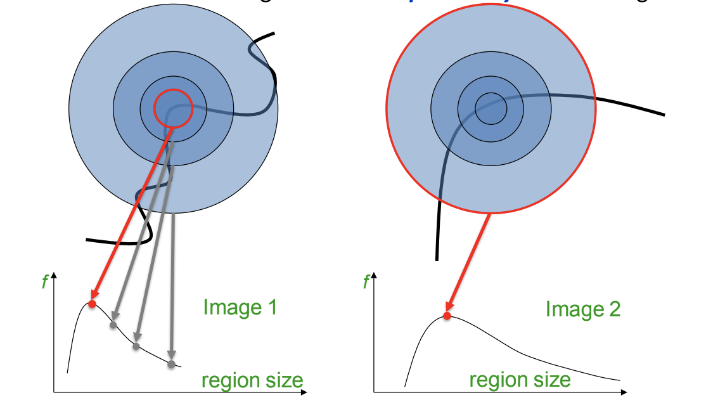{width="\\textwidth"}

This best region size is also co-variant with image scale.

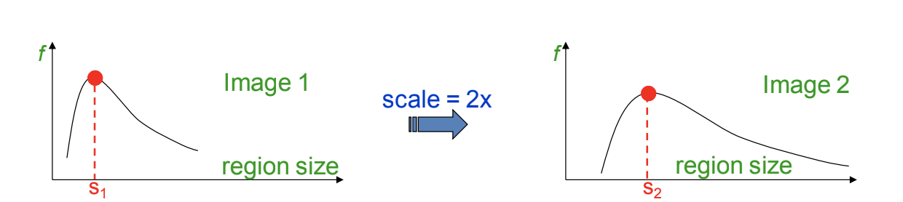{width="\\textwidth"}

## Properties of a Good Function

It is important to design a function that is \"scale invariant\",
meaning that the same outputs are produced for corresponding regions of
images with different scales. For example, average intensity is a scale
invariant function because even if the image is scaled to be larger,
taking the intensity/brightness averages of corresponding regions
between the two images will be the same. A good function should also
have one stable sharp local maximum and respond well to contrast changes
in the image.

{width="\\textwidth"}

In this class, we use functions of the form f = kernel \* image for
determining scale. Here, we have two choices for a kernel: Laplacian of
Gaussians and Difference of Gaussians.

## Laplacian of Gaussians Kernel

This kernel is defined by:
$L = \sigma^2(G_x{}_x (x, y, \sigma) + G_y{}_y (x, y, \sigma))$. For
this kernel, we can plug in different region size inputs into the
Laplacian and then take the maximum of the f = Laplacian \* image. In
the Harris-Laplacian method, we run the Harris Corner Detection normally
on a predefined scale to detect points first, then we plug in different
neighborhood size inputs into the Laplacian, and take the maximum of f
to detect the best scale. So, overall, we are extending Harris' measure
of corner response over an image to be invariant with scale.

## Difference of Gaussians Kernel

This kernel is defined by: $DoG = G(x, y, k\sigma) - G(x, y, \sigma)$.
We can also use a Difference of Gaussians kernel, which accounts for
both choosing the most optimal space and scale. We start by considering
different Gaussian kernels at changing scales/sigma values, and then we
compute the differences of consecutive Gaussians, which are each then
convolved with the original image. Then, we then stack these output
differences into a tensor.

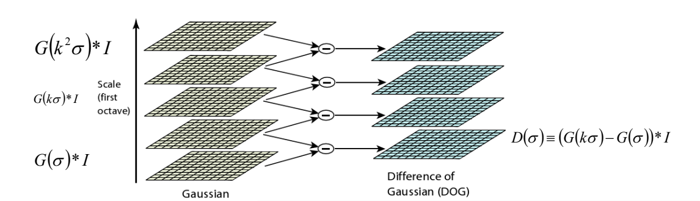{width="\\textwidth"}

Now, the next step is space optimization, specifically by choosing pixel
extrema in each scale in the tensor. This is done by comparing each
pixel to other pixels in the same scale and in adjacent (above and
below) scales in the tensor.

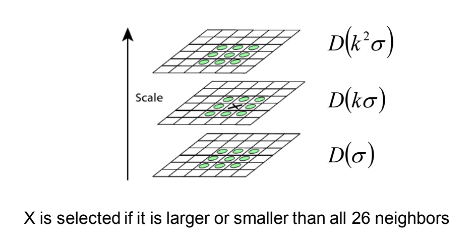{width="\\textwidth"}

## Detector Performance Evaluation

The evaluation metric for detector performance is repeatability (no. of
correspondences / no. of possible correspondences), indicating how well
the detector can find the same points when the images are resized. As a
result, better detectors have higher repeatability scores across all
scale variations of an image. As seen in the image, Harris-Laplacian and
SIFT (Lowe) have higher repeatability scores than the original Harris
algorithm, even though they are not perfect methods.

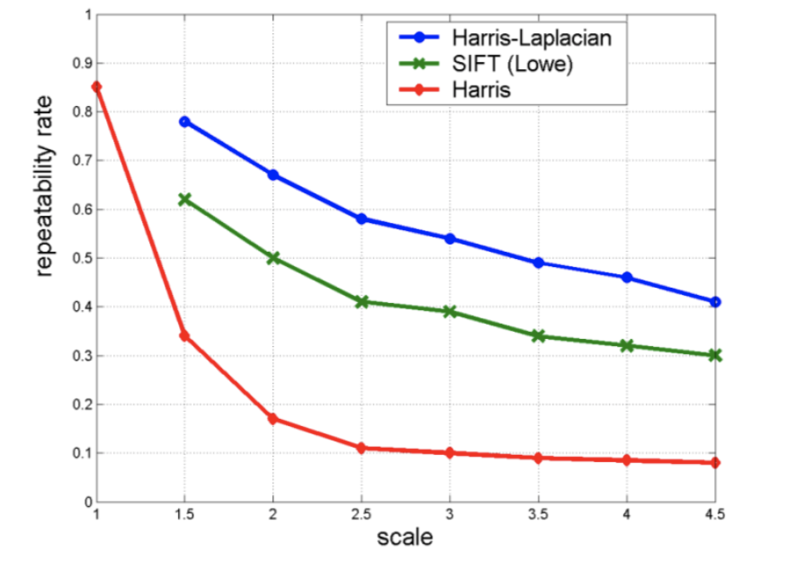{width="\\textwidth"}

## Takeaways and Applications

Overall, Scale invariant keypoint detection can be addressed by finding
maxima of \"good\" functions in both scale and space over an image.
There are many applications to Scale invariant keypoint detection,
including searching for objects in different pictures and panorama
stitching.

# SIFT

## Introduction and Motivation

By now we have seen that it is possible to detect various numbers of key
points in an image. The next important step is to be able to describe
the key points for purposes such as matching. For example, in the below
two photos:

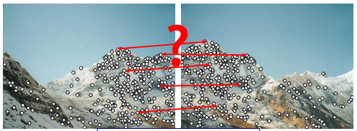{width="\\textwidth"}

We can see that we have many key points, but it is important to tell
which points in one image correspond to points in another image in many
real life applications.\
To do so, we need to make sure that our point descriptor should be
invariant and distinctive. We have mostly taken care of the
distinctiveness in our key point selection, and will revisit its
effectiveness in section 3.4. The features we extract must be invariant
to translation, rotation, scale, etc.

## Rotation Invariance

One of the more important properties of SIFT is that it is rotation
invariant. Suppose that we take a patch of an image around a key point.
At the start, we may not know its correct orienation. One option we have
is to normalize patches by rotating them, trying out (potentially 360)
rotations until we reach our best fit. The second option, which SIFT
entails, consists of describing all features relative to a
characteristic orientation.

::: center
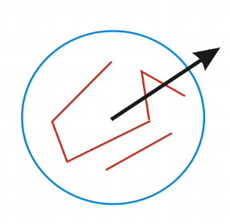{width="30%"}
:::

That is, first we determine a direction for the keypoint (often the most
prominent gradient). Then, we describe all features relative to this
orientation, usually with subtraction. Even if the image itself was
rotated, all the features would remain the same relative to the key
direction.

## SIFT descriptor formation

The above idea is the foundation for our SIFT descriptor. SIFT stands
for Scale-Invariant Feature Transform and is a descriptor based on
gradient information. Effectively, this method attempts to capture the
texture around a key point neighborhood of pixels.\

::: center
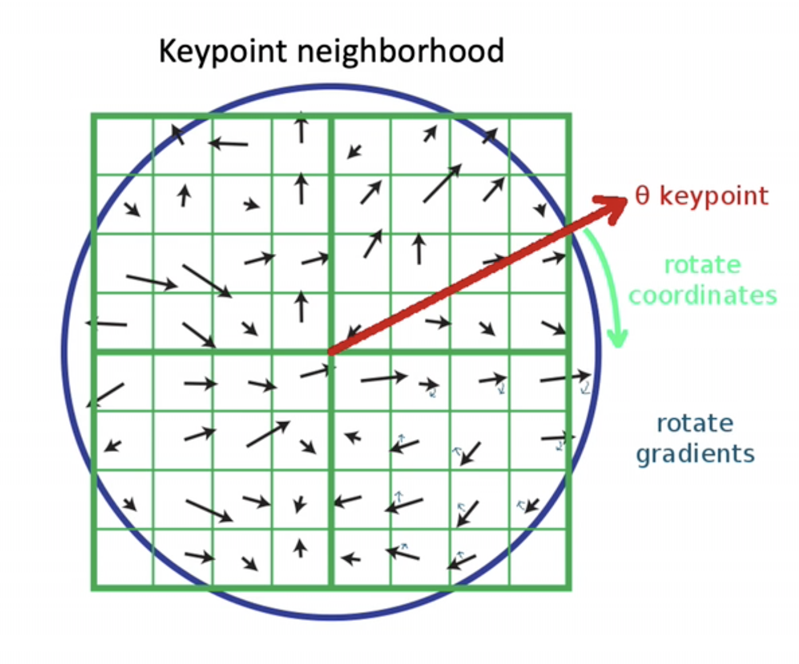{width="50%"}\
:::

To achieve this, the image is first blurred and an image patch of
$n\times n$ pixels is extracted centered around the key point. For
optimum performance, most image patches are of size $8\times 8$ pixels.
Afterward, image gradients are taken for each pixel in the key point
neighborhood. To become image invariant, each neighborhood pixel
gradient direction and location is rotated by the negative angle of the
key point orientation. This allows us to cancel out rotation and express
the gradient locations relative to the key point orientation $\theta$.\
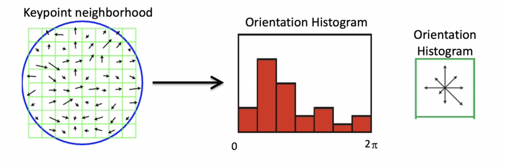{width="\\textwidth"}

Once we have calculated the gradients within the selected neighborhood
of pixels that were normalized relative to the domain orientation, we
then stack the gradient numbers into a vector. Unfortunately, it is
fragile to use precise gradients when defining our vector and we will
require slight imprecision in the pixel configurations of the image. To
achieve this while maintaining a relatively accurate descriptor, we
introduce an array of histogram bins to categorize the gradient numbers
into 8 distinct orientations. This array spans from angle $0$ to $2\pi$
in increments of $\pi/4$ rad.\

::: center
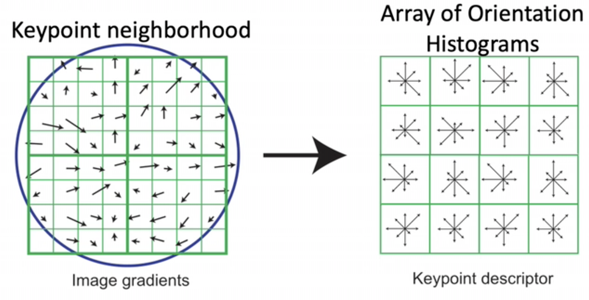{width="70%"}
:::

As you may expect, one histogram/vector may not contain enough
information to properly convey the distinctiveness of all 64 squares.
For this reason, we split the image further into a $4\times 4$ histogram
array, yielding $8 \times 4 \times 4 = 128$ numbers. This results in a
length 128 vector which is invariant to rotation and scale. We can then
compare vectors in two different images to find matching key points.\
From here, we need to account for illumination changes in the image. It
is highly likely that images are captured under varying lighting
conditions, which necessitates a more robust method of representing the
descriptor. It is important to note that since the descriptor is made of
gradients, it is already invariant to direct changes in brightness.
However, a higher contrast photo will increase the magnitude of the
gradients linearly. To account for this scaling, we normalize the
histogram array such that its magnitude is $1.0$.\
Additionally, we can further account for large image gradients that
often arise from unreliable 3D illumination effects, such as glare. To
reduce this effect, we can clamp the values of the histogram to be at
most $0.2$, and normalize the vector again. The result is a vector which
is fairly invariant to illumination changes.\

## Sensitivity, Stability, and Distinctiveness

Why do we choose to use 8 orientations with a descriptor width of 4?

Empirically, researchers have seen that 8 orientations, coupled with a
descriptor width of 4, provides the most accurate results.\

::: center
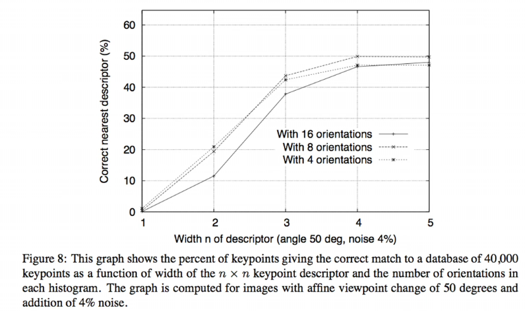{width="\\textwidth"}
:::

So how well does SIFT work? Empirically, researchers have shown that
SIFT is quite robust to noise, and frequently correctly identifies the
nearest descriptor, meaning that its features for each keypoint are
mostly unique and descriptive.

::: center
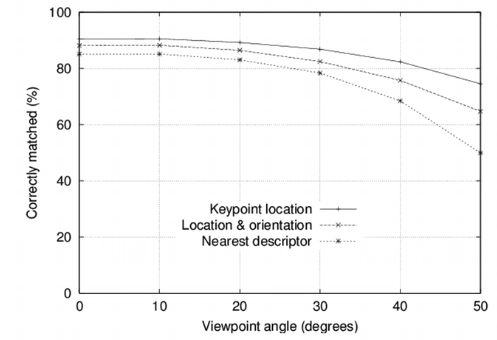{width="70%"}
:::

(Above): We can see rather strong performance, even up to a viewpoint
angle of 50 degrees. In addition to 2% image noise, we can see that SIFT
is robust to affine changes.\
(Below): Even with over 100k keypoints, SIFT is distinctive enough to
identify the exact nearest descriptor about three-quarters of the time.

::: center
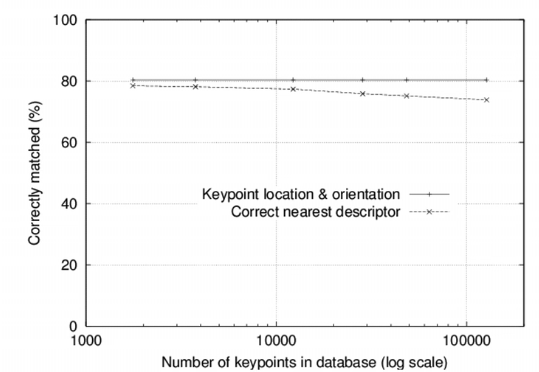{width="70%"}
:::

## Applications

SIFT's local invariance ability allow its use to span across numerous
real world applications, including but not limited to: Recognition, Wide
baseline stereo, Panorama stitching, Mobile robot navigation, Motion
tracking, and 3D reconstruction.

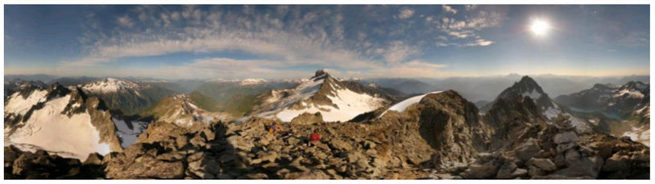{width="\\textwidth"}

# HoG

## Histogram of Oriented Gradients Overview

Histogram of Oriented Gradients (HoG) is a type of feature descriptor.
It is similar to DoG, but HoG can cover all of an image.

## Method

: HoG works by exploiting the fact that local objects (specifically
their shape and appearance are recognizable by their local intensity
gradients (typically).

::: center
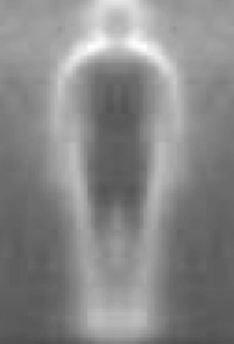{width="25%"}
:::

Example of a HoG compilation of images of pedestrians.\
To use HoG, divide the image into uniform cells, which can be circular
(C-HoG) or rectangular (R-HoG). Then, calculate a histogram of weighted
gradient directions of each pixel for each cell. Finally, normalize
these histograms at the cell level and also at a larger block of cells
level.

::: center
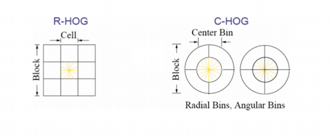{width="70%"}
:::

This diagram shows a visualization of how normalization of cells is
conducted for HoG.

## Differences with SIFT

: HoG: normalized to neighborhood bins and (often) used for image
regions that are bigger than just a feature.

SIFT: normalized to dominant gradient and used for key point detection.

